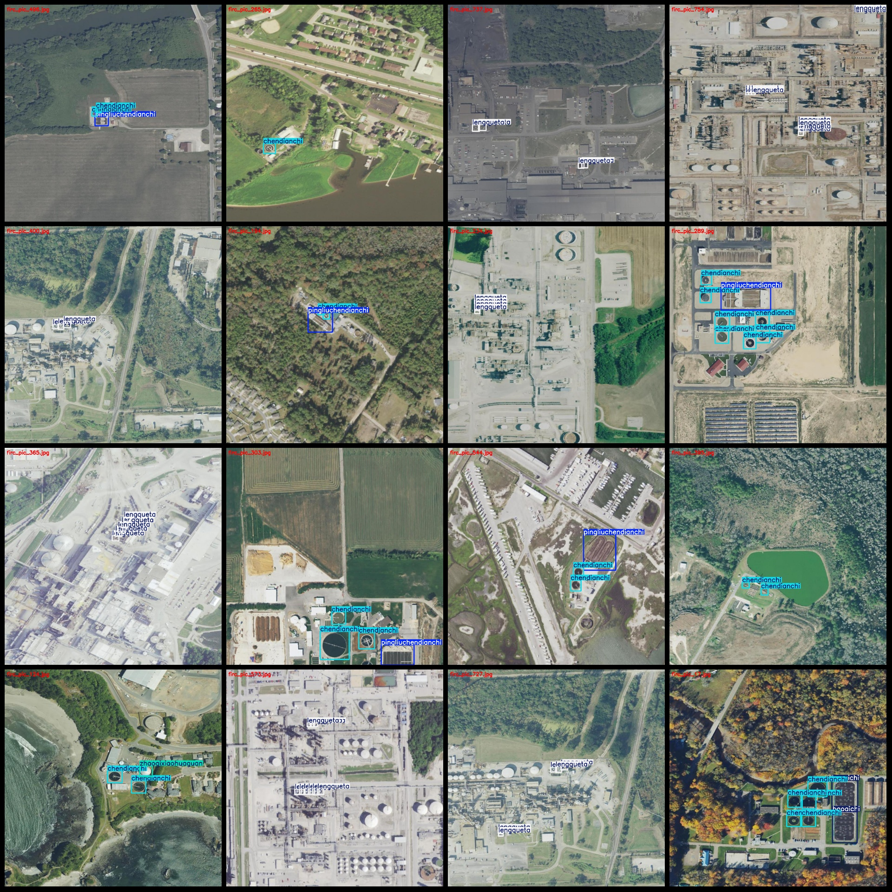
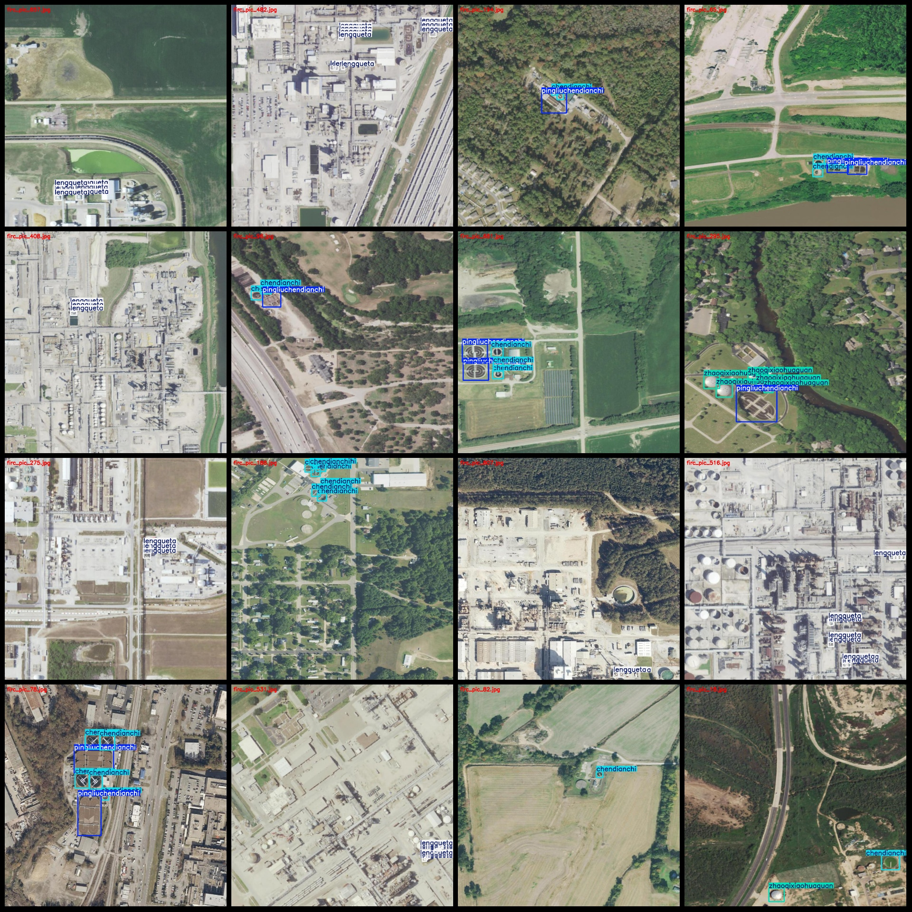
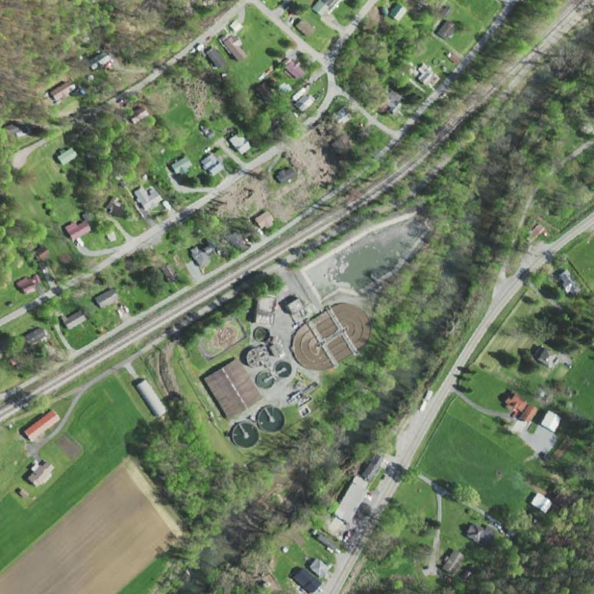
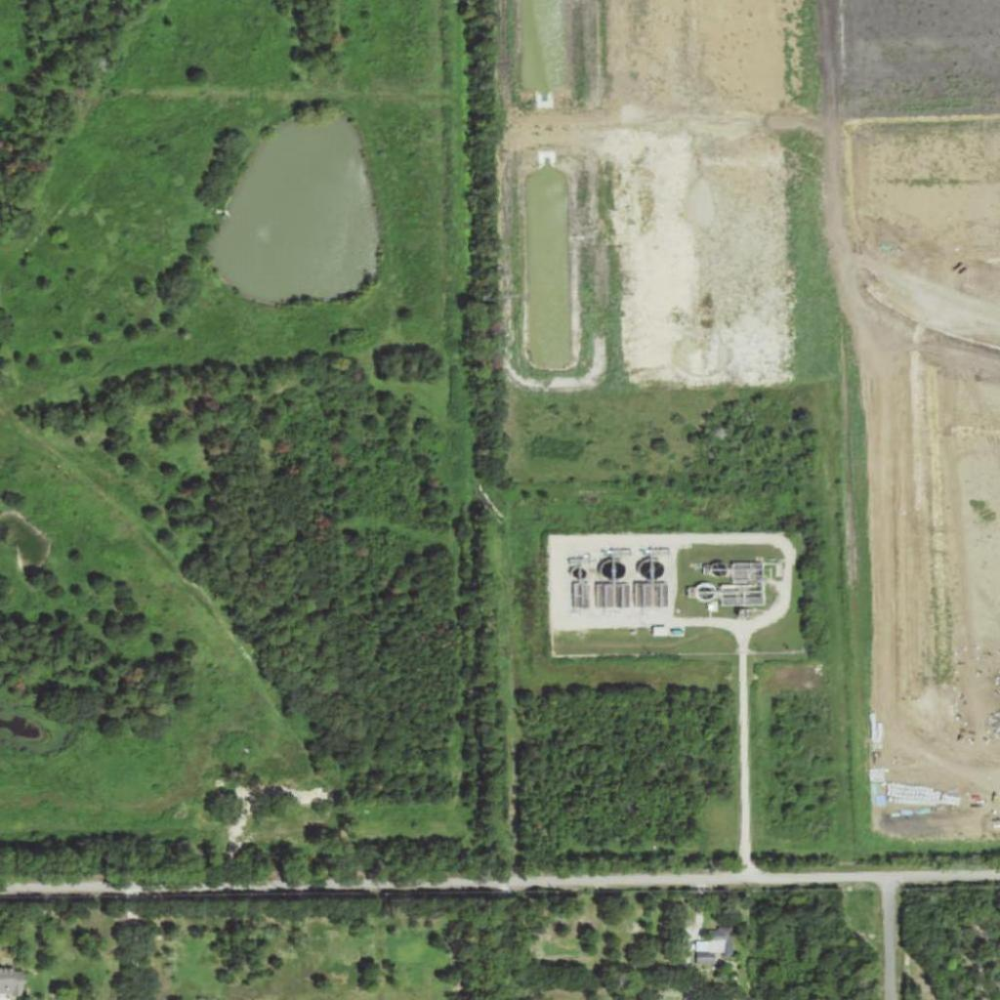

# Remote Sensing Image Water Treatment Facilities Detection Dataset - VOC + YOLO Format, 849 Images in 5 Categories

### Datasetformat: Pascal VOC format+YOLO format
(The text file does not contain a split path, but only contains jpg images and corresponding VOC format xml files and yolo format txt files)

**Image Count (Number of jpg files): 849**

The number of XML files labeled as "849" is 849.

**annotation count: 849**

```
(5)
```

Annotation class names:
- ["biogas digester", "aeration tank", "cooling tower", "straight flow sedimentation tank", "biogas digester"]

**corresponding Chinese class names: **
- ["Aeration Tank", "Settlement Tank", "Cooling Tower", "Plain Sedimentation Tank", "Biogas Digestion Tank"]

**Number of boxes labeled per category:**
- baoqichi: 118
- chindianchi: 1640
- lengqueta: 2770
- pingliuchendianchi: 148
- zhaoqixiaohuaguan: 94

**Total Frames: 4770**

**images per class: **
- baoqichi: 83
- chindianchi: 475
- lengqueta: 356
- pingliuchendianchi: 114
- zhaoqixiaohuaguan: 38

Resolution: 1024x1024

Using the labeling tool: labelImg

```
annotation:
  rules:
    - rule: Rule Name
      condition: Condition
      action: Action
```
Draw a rectangle around the class.

**Important Note:**
The dataset does not need to be split into training, validation, and test sets.

**special statement: **
This dataset does not guarantee the accuracy of the trained model or weight file.

<p>image preview:</p>
Image







Here is a pay link on Stripe ( https://buy.stripe.com/3cs8yP7sY87d0vu9AB ). Please contact me lonlonago@foxmail.com after funding $89, and I will send you a complete data files , thank you!

